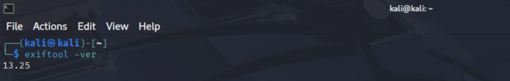
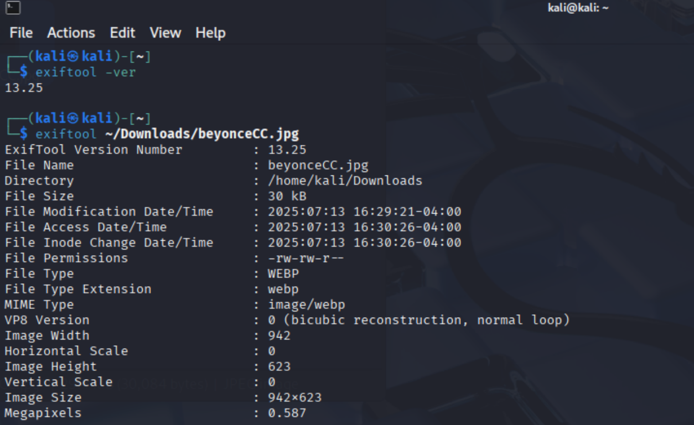
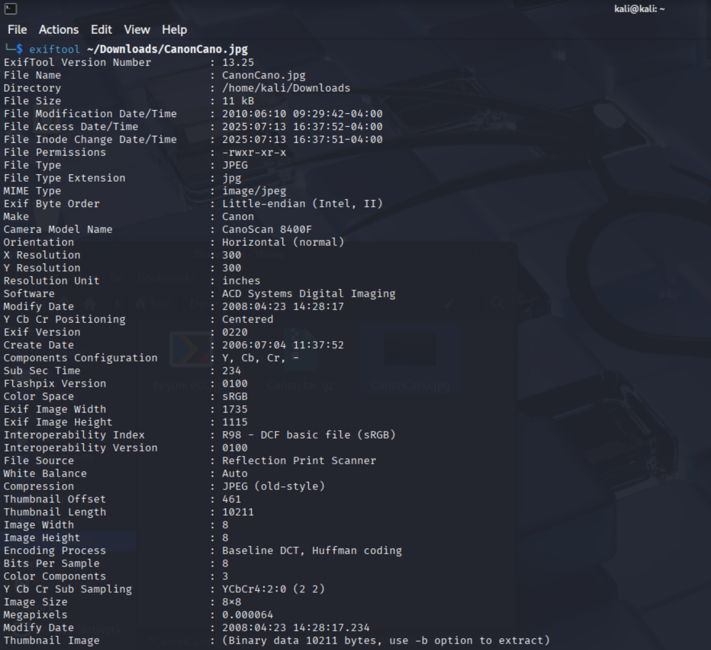
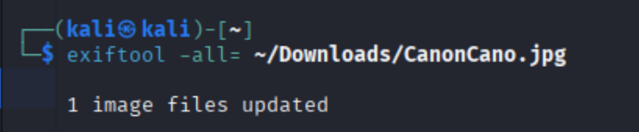
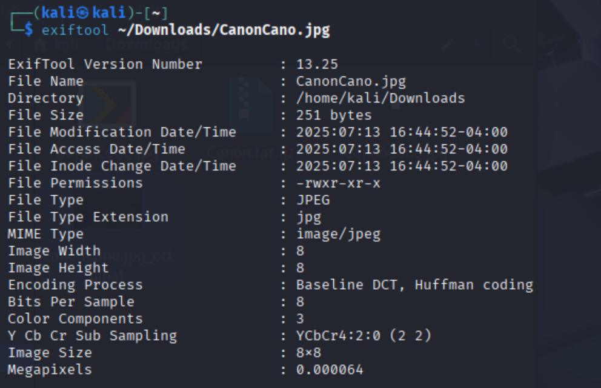

# 🧪 ExifTool File Metadata Analysis Lab

This lab explores how SOC analysts and threat hunters can use `exiftool` to extract, analyze, and strip metadata from image files. I used Kali Linux and walked through a realistic phishing investigation scenario to identify suspicious metadata fields like weird author names, image creation dates, and editing software.

---

## 🧠 Why I Did This

Files often tell on themselves.

Even when they look harmless, images and documents can hold hidden details that expose how they were created, edited, or tampered with. In a real SOC setting, this skill could help confirm suspicions during phishing investigations, insider threat cases, or digital forensics reviews.

---

## 💻 Tools Used

- Kali Linux
- exiftool v13.25

---

## 📝 What I Learned

- How to extract metadata from `.jpg`, `.webp`, and other file types using the terminal
- How to interpret key fields like `Author`, `Software`, `GPS`, and timestamps
- How to identify red flags in metadata that could indicate phishing, tampering, or tracking
- How to completely remove metadata using `exiftool -all=`

---

## 🧪 Real-World Scenario: Phishing Attachment

A user reported a suspicious email claiming they had won a gift card. The email included a `.jpg` file. I used `exiftool` to extract metadata from the file and found:

- A camera model that didn't match the email context
- Editing software that raised red flags
- A creation date years before the email was sent

These were signs of tampering or potentially malicious intent.

---

## 📸 Screenshots

### 1. Verified exiftool version  

### 2. Metadata from personal file  

### 3. Suspicious metadata (sample image)  

### 4. Metadata wipe command  

### 5. Post-strip verification  

---

## 🧹 Bonus: Metadata Redaction

I also practiced wiping metadata from an image file using `exiftool -all=`, which simulates both attacker behavior (covering tracks) and safe SOC practices (redacting sensitive data before sending to legal, HR, or external vendors).

---

## 🔎 Keywords (SEO)

SOC Analyst, Metadata Analysis, exiftool, Cybersecurity Lab, Phishing Email Analysis, Digital Forensics, Image Forensics, File Metadata, Kali Linux, Triage Workflow

---

